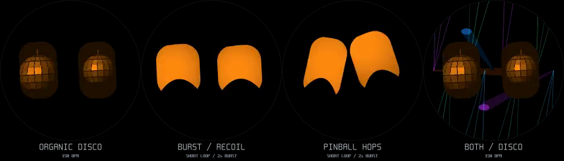

# Music reference capture and organic dance

[Open the Music Lab guide](../../tools/music-lab/README.md) for the local USB
coordination page, full-track collection workflow and compact file format.
The page labels music and negative examples, marks problem sections, shows live
bass/beat evidence, and downloads all runs as one `.mcal` file. It does not tune
thresholds automatically. Device audio, room placement and human timing labels
are needed before choosing sensible parameter changes.

## Short-loop flourishes

The original onset detector keeps its 250 ms minimum gap and tempo-dependent
refractory period. Those are useful for avoiding double-counted beats, but hide
fast DJ subdivisions. A separate tiny state machine observes the same bass-onset
candidates before that gate. It learns their recent stable interval, including
ordinary offbeats, and requires at least a 2.5-second sustained musical lock.

A new pulse sequence must have three consecutive consistent intervals (four
onsets), be over roughly 22% faster than that recent candidate rhythm, and have
real bass energy. The minimum candidate separation is 96 ms. A sustained new
rate fires once; a slower return can rearm it, with an eight-second cooldown.
Recent lock may survive up to eight seconds while a short loop unsettles the
normal tempo estimate. Quiet input, own playback and stale lock do not qualify.

In an existing dance this produces a two-second outward burst/recoil or bounded
pinball hop. The event must be fresh; reentering dance cannot replay an old one.
Quiet audio cancels it. It does not itself enter dance or fabricate main beats.
`rush_bpm` is the subdivision rate, which need not equal the song's true BPM.
This first pass targets abrupt accelerations and short loops, not arbitrary DJ
beat tracking or gradual tempo-ramp estimation.

Tests include synthetic 125 → 250 → 125 → 187.5 pulse rates, event latency,
cooldown, stale/quiet/muted rejection, and negative controls with steady EDM
at 100/125/150/180 BPM, strong offbeat snares, speech-like audio, hum and noise.
The negative controls caught two early false-trigger cases: normal subdivisions
and short accidental speech locks. The final detector rejects those fixtures.

## Independent disco balls

Each eye gets its own 64×64 lightness cache. A stable seed per dance session
chooses different rotation phase and speed; slow sinusoidal camera movement
varies the zoom (roughly 1.0–1.41×) and shifts the ball gently within the eye.
There are no random jumps each frame. The dim eye silhouette remains visible.
Only cache setup uses the added floating-point work; the pixel loop keeps its
integer texture walk, with two constant camera offsets per scanline.

The extra cache is 4 KB. Representative host disco setup measures about 6.5 µs,
with setup+raster around 79 µs upright and 134 µs rotated. These are host timings,
not ESP32 figures. The broader background-light transfer cost is unchanged.

The first real capture also exposed slow scattered PSRAM raster writes and
microphone-analysis preemption by the render worker. Drawing now uses one
14,912-byte internal-RAM band before a sequential copy to the PSRAM frame buffer;
the two-core band job finishes before that copy. Microphone analysis has priority
9, above the raster worker at 8. This keeps calibration/sound analysis from
waiting for a heavy background band. Hardware results are recorded below.

[Watch the 12-second preview](dance-organic.mp4).
Order: **organic disco / outward burst and recoil / pinball hops / disco with
both background lights**. The two flourishes run at 4–6 seconds; preview events
are scripted to compare them. Animation and compositing use the firmware C code.



## Hardware and browser validation (September 7, 2026)

The firmware was built and flashed to the USB-connected ESP32-S3; esptool verified
upload hashes. Chrome on the Mac exercised connection, stream start, recording,
markers, end-run, download, reopening the file, label correction and acknowledged
disconnect. The first real 68.3-second run saved 4,267 records with no reported
queue overflow or timing gaps. A subsequent 109-second run and its breakdown
marker were preserved separately from synthetic fixtures; that run reports 120 ms
of timing gaps. Sources were not verified, so these are transport/performance
observations, not detection-accuracy measurements.

Before the internal-RAM change, that first mixed listening/dance run sampled
13–60 FPS (median 27) and audio-analysis elapsed times up to 4.31 ms. After the
change, a 60-second hardware capture sampled 53–61 FPS (median 60), with audio
analysis 0.283–0.722 ms (median 0.435 ms) and no queue-overflow reports. This
follow-up contained **no dance frames**: it verifies ordinary-expression operation,
not the worst-case combined lighting cost. Heavy dance still needs a comparable
hardware run. One-second log samples are not a worst-case execution-time proof.

Host regression checks cover audio negatives and accelerations, dance camera and
flourish behavior, UI scrolling, binary trace round trips and existing personality,
interaction and play behavior. A 49,056-frame renderer sweep reports no bounding
box or guard violations. Raw room recordings remain local rather than in git.

## Further eye-fill ideas to consider

- **Rising hearts:** several small hearts float upward at different depths, with
  a kick giving them a small upward impulse. Normal eye outlines and lids stay.
- **Liquid groove:** two or three soft blobs merge and separate inside each eye;
  bass controls the bulge, treble adds a few small bubbles.
- **Pocket fireworks:** a beat launches a tiny spark from the lower lid, followed
  by a sparse radial burst. Both eyes can answer each other a beat apart.
- **Orbiting stars:** little stars drift around an off-centre light, with a brief
  comet trail on stronger hits.

These are proposals, not new scheduled fills in this revision. Small cached
textures or bounded particles would fit the existing approach; each still needs
visual and transfer-cost checks before joining the random show schedule.

Regenerate:

```sh
tools/host/build.sh dance_organic_preview
tools/host/bin/dance_organic_preview
ffmpeg -v error -y -f rawvideo -pixel_format rgb24 -video_size 932x265 -framerate 30 \
  -i tools/host/out/dance-organic.rgb -vf 'pad=932:266' -c:v libx264 -crf 23 \
  -pix_fmt yuv420p -movflags +faststart docs/dance/dance-organic.mp4
tools/host/build.sh rush_test -fsanitize=undefined -fno-sanitize-recover=all
tools/host/bin/rush_test
```

## Dedicated recording update

USB recording now pauses all eye rendering and display transfers until explicit
exit (Disconnect / MC_STOP, or a two-second PWR hold). It has no lease timeout
and does not stop on an unexpected USB disconnect. Microphone analysis remains
62.5 frames/s; display FPS is deliberately zero. V2 adds CRC/sequence tracking,
analysis timing and sixteen raw FFT power bands, with per-track and corpus
frequency summaries (~240 KB/minute). Legacy captures remain readable. See
[the current protocol and workflow](../../tools/music-lab/README.md).

The recorder now also supports lossless stereo PCM and a local timeline editor with range labels: [stereo capture and verification](STEREO_CAPTURE.md).
