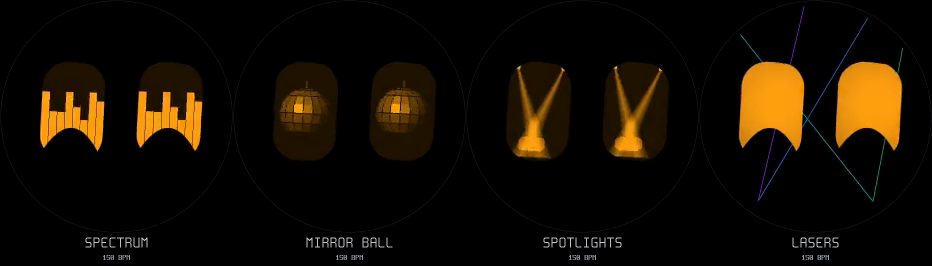

# Dance shows and rhythm handling

[Watch the 12-second preview](dance-show.mp4) (about 475 KB).



Panels, left to right: **spectrum**, **mirror balls**, **spotlights**, **lasers**.
The real C animation and rasteriser run at 60 Hz; the video exports at 30 Hz.
The input is synthetic: 150 BPM for four seconds, an audible breakdown for
four seconds, then the kick returns. Captions and the faint display outline
are preview annotations. The preview forces each show for comparison; on the
device they appear occasionally, with plain dancing between them.

On Windows after pulling:

```powershell
Start-Process docs/dance/dance-show.mp4
```

## Visual changes

- All eye fills retain the spectrum analyzer's dim eye silhouette (lightness
  level 4/31), including unused space around the circular mirror ball. The
  baseline is baked into the small texture, with no extra outline drawing pass.
- Mirror balls have a circular silhouette, a suspension thread, curved facet
  rows, perspective around the sides, and reflections that move coherently
  as the sphere rotates under a fixed light.
- Spotlights have two visible fixtures, widening cones and bright elliptical
  pools where the beams land. Their targets sweep; kicks widen the cones.
- Lasers are four thin coloured beams behind the opaque eyes, with eased
  sweeps and fan/crossing patterns selected every four detected beats. A show
  lasts 6.5 seconds and fades in/out. Old beam positions are erased on movement
  and exit. The background follows the display orientation.
- Beat motion uses the audio onset timestamp and measured kick strength.
  Its decay follows tempo, avoiding the old fixed 380 ms overlap at fast BPM.
  Smoothing, spectrum decay and ball rotation follow elapsed time.

## Kick detection and breakdowns

The existing 80 Hz kick filter contains useful kick energy in the supplied
offending preview. The principal failure was the onset gate: it required
1.6 times the recent mean and a 25% rise within one 16 ms frame. Rolling bass
raises that mean, and a kick can rise across several frames. The gate now uses
1.25 times the mean and a 10% frame rise. Once a rhythm is confirmed, the
refractory period is 0.55 beat intervals, with the existing 250 ms floor.
An uncertain tempo cannot establish that longer refractory period.

Music entry still requires eight onsets, 85–185 BPM, confidence at least 0.75,
and a sub-bass/full-band RMS ratio of at least 0.08, through the existing
behavior state machine. Confidence now requires seven measured intervals and
counts **unfolded** intervals within 12% of their median. Previously, treating
half/double intervals as matches could make irregular speech look regular.
The folded regularity metric remains available separately.

After music has been confirmed, audible passages can hold dance mode for up
to **45 seconds without confirmed rhythm**, replacing the old six-second
exit. After 1.2 seconds without a kick, movement settles into a gentle sway
and quieter bass breathing. No artificial beat events are generated; the
first returning detected kick drives the next hit immediately, without
waiting for music admission again. Continuous raw RMS below 45 LSB exits
after **2.2 seconds**. Disabling audio or placing the device face down still
exits immediately. The 45-second limit prevents unrelated sound from holding
an old music session indefinitely.

## Validation and limits

The host replay builds the exact `main/audio.c` analysis path, excluding device
I/O, then feeds its features into `behavior_update()`. Public Spotify previews
were converted locally to mono PCM16 at 16 kHz and level-matched to 300 LSB RMS.
They are not included in this repository.

| Input | Result |
| --- | --- |
| [Never Forget — Ueberrest](https://open.spotify.com/track/1Ddlc2T6zTUz0w7ynzxkso), 25.6 s preview | Before: 6 onsets, no eligible music frames. After: 61 onsets, 150 BPM, 87.3% eligible frames including startup; actual behavior dances for 20.8 s. |
| [Blütezeit — Schrotthagen](https://open.spotify.com/track/0hlTJ3QkR4JIWX5sQi6lKk), 24.3 s preview | 67 onsets, final estimate 156.2 BPM; actual behavior dances for 19.8 s. This is not a test of the full track's one-minute breakdown. |
| Daniel and Samantha spoken paragraphs | Neither enters dance mode. Samantha briefly satisfies raw rhythm thresholds for 0.54 s; the existing listening behavior prevents admission. |
| Synthetic EDM at 100, 125, 150 and 180 BPM | All enter and sustain dance mode despite loud offbeat snares; measured tempo within 8%. |
| Synthetic speech-like syllables, room noise, 60 Hz hum | No dance entry. Muted own-speaker playback produces no beat events. |
| Synthetic 36 s audible breakdown + kick return | Retains dance mode throughout; silence exits within 2.5 s; unconfirmed audible sound cannot hold it beyond the grace period. |

The two spoken clips and Never Forget were also replayed at 150 and 900 LSB
RMS: the music result was stable and raw speech eligibility stayed brief or
zero. These are bounded regression checks, not a general speech/music
classifier evaluation. The speaker, room and board microphone transfer path
were not reproduced, and the exact one-minute passage still needs a device
check.

ESP-IDF firmware build passes. UBSan checks pass for audio/behavior, laser
occlusion and rotated damage bounds, clean laser exit, refresh throttling,
coasting without extra kicks, and animation timing at 16/32 ms intervals.
Character and rim integration tests pass; the 44,676-frame animation sweep
reports zero bounding-box/guard violations.

## Performance

Disco and spotlight geometry is generated once per frame into a shared 64×64
lightness texture. Each eye's pixel loop uses integer coordinate increments
and a lookup; the former per-pixel divisions and hashing are gone. The sphere
projection is prepared once at initialization. Storage is 4 KiB per eye-pair
texture plus roughly 16 KiB of static projection tables. The four-beam laser
snapshot is approximately 7.5 KiB. No frame-time heap allocation is added.

Representative host `dance_bench` measurements, including texture setup and
both eye regions, in microseconds per frame:

| Effect | Before upright / 33° | After upright / 33° |
| --- | ---: | ---: |
| Mirror balls | 262 / 331 | 82 / 125 |
| Spotlights | 172 / 233 | 80 / 128 |

Host timings vary with scheduling and are **not ESP32 timing measurements**.
Laser generation is capped at 30 Hz; intermediate frames repaint only eye
damage over the unchanged background. Changed background frames repaint the
union of previous/current beam bounds and eye/accessory damage. The upright
benchmark averages about 141,000 pixels per background update, 118 µs host
CPU, and 7.1 ms theoretical RGB565 transfer at 80 MHz quad SPI. Rotation and
wide patterns can approach a full frame (10.9 ms theoretical transfer).
Protocol, copying and scheduling add overhead; use the existing device
raster/transfer/audio CPU counters to verify the hardware budget. The audio
change adds no FFT, filter or analysis pass.

## Reproduce

```sh
tools/host/dance.sh
tools/host/build.sh dance_bench && tools/host/bin/dance_bench
tools/host/build.sh audio_test -fsanitize=undefined -fno-sanitize-recover=all
tools/host/bin/audio_test
tools/host/build.sh dance_test -fsanitize=undefined -fno-sanitize-recover=all
tools/host/bin/dance_test
tools/host/build.sh audio_replay
tools/host/bin/audio_replay recording-16k-mono.wav 0 frames.csv
```

RMS argument `0` preserves recorded microphone levels. Positive values
normalize the entire clip for comparisons; the default is 300 LSB. Replay
reports both raw music eligibility and actual behavior time in dance/listen,
using an awake, full-energy character. `frames.csv` includes beat timestamps,
kick strength, raw loudness, tempo confidence, speech state and band levels.

Further dance ideas: a slow anticipatory squeeze during a build-up that opens
on the returning kick; occasional half-time swagger while still detecting
every beat; alternating bass-led and high-frequency eye gestures for a
call-and-response feel. These are ideas, not additional detector heuristics
in this change.
