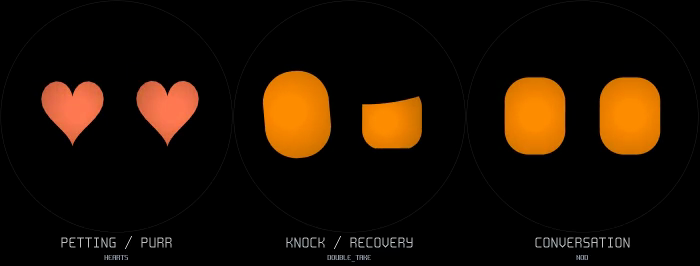

# Situational expressions

[Watch the 12-second preview](personality.mp4): petting/purring, knock/recovery,
and conversation, from left to right. It runs the real behavior and animation
code at 60 Hz and exports at 30 Hz. Inputs are scripted, including a five-second
actual-purr flag and an accepted conversation acknowledgement; there is no audio
in the preview. Captions and display borders are annotations.



```powershell
Start-Process docs/expressions/personality.mp4
```

## Affection and handling

| Situation | Visible response |
| --- | --- |
| Two forehead strokes within 2.5 s | Happy for 0.9 s, love until 2.4 s, then beating hearts while petting continues. Further strokes extend petting without restarting the sequence. |
| Mouth actually playing a purr | Love for 0.9 s, beating hearts until 3.3 s, then happy until playback ends. This overrides an idle face or petting phase, including when the purr comes from a stationary forehead hold. |
| Petting/purr finishes | A relieved exhale if unoccupied; no delayed performance if attention has moved elsewhere. |
| Picked up after resting | A double-take, allowed to finish during gentle movement. No automatic carry purr. |
| Walking/carrying | Curious, or determined when energetic and in a good mood. |
| Set down | Relieved exhale. |
| Body knock | Double-take for 5.2 s, then embarrassed when calm or suspicious when sour. New touch or strong shaking takes priority. |
| Non-eye tap | Springy boop; annoyance when already sour. Three close taps get suspicion. |
| Eye tap | Preserve the ordinary face and close only the tapped eye, relaxing its lower lid. Repeated pokes can leave a suspicious look after reopening. |
| Excessive shaking | Existing dizzy → slumped KO → staggered recovery. After recovery, relief or heartbreak according to mood. |
| Turned upright after being face down | Existing waking reaction, then relief. |

Actual purring is reported by the speech task during gesture rendering, so
queued or rejected requests do not start heart eyes. The face never masks a
poke, handling, dance, KO, sleep or a menu. A steady forehead hold still needs
3.5 seconds, and carrying/motion resets it. A later deliberate hold can purr
again; recent-word suppression no longer converts a repeated purr into babble.

## Company, food and attitude

| Situation | Visible response |
| --- | --- |
| Someone speaking | Mostly curious, with occasional nods, happiness, a double-take or a suspicious look when sour. Selected choreography finishes before the next listening-face roll. |
| Conversation pauses for over 2 s | A nod, or a loading/thinking action when tired. Renewed speech interrupts it. |
| Hungry and connected to USB | Hearts below 20% battery; relief at 20–79%; smug satisfaction at 80% and above. |
| Disconnected from USB | Pleading below 20%; a nod otherwise. |
| Battery below 15%, away from USB | One pleading scene when free, at most once every five minutes. Works without a speaker. Unknown battery readings do not trigger it. |
| Declines to dance | Smug expression through the existing unimpressed reaction. |

Listening uses speech timing and mood. It does not infer the meaning of nearby
conversation. Spoken-line gestures below follow the character's own selected
words.

## Voice and face together

An accepted utterance may request one contextual expression. “Okay” and “aha”
get a nod; “thank you” gets relief; “oopsie” and “sorry” get embarrassment;
“seriously?” and “really?” get a double-take; “nice try”, “as if” and other
cheeky lines get smugness. Requests for food get pleading; affectionate lines
get hearts; “come on” gets determination. Greetings choose playful peekaboo or
a cautious peek according to mood. “Peekaboo” gets mischief and “bingo” can
start the reels when no performance is already running.

A voice suggestion cannot replace an existing contextual scene, idle
performance, purr or physical reaction. For example, an idle high roller keeps
its authored reel stops and celebration even if it says “bingo”. If spontaneous
speech becomes due during a new scene, the existing chattiness schedule chooses
a matching remark; it does not insert an unrelated random line. The sneeze
stays wordless. No additional periodic chatter timer is added.

## Coverage of all 28 additions

All 26 non-KO additions retain their mood-qualified, non-repeating idle route.
This table lists their additional roles or why their spontaneous role fits.

| Animation | Role beyond a generic random face |
| --- | --- |
| SMUG | Dry retorts, full-battery charging, declining music. |
| SUSPICIOUS | Repeated pokes, sour listening, boundary-setting lines, sour knock recovery. |
| DETERMINED | Energetic carrying and “come on”. |
| PLEADING | Low battery, hungry unplugging, “feed me” and “oh please”. |
| MISCHIEVOUS | “Peekaboo” and energetic, playful idle behavior. |
| EMBARRASSED | Calm recovery from a knock, “oopsie” and “sorry”. |
| RELIEVED | Set down, petting/purr finish, waking/recovery, charging and thanks. |
| DOUBLE_TAKE | Pickup, body knock, animated listening and incredulous lines. |
| KNOCKED_OUT / RECOVERING | Excessive-shake state machine. |
| HEARTS | Actual purr, sustained petting, hungry charging, affectionate lines. |
| HEARTBREAK | Sour shake recovery, “oh no”, unhappy idle moments. |
| HIGH_ROLLER | Playful idle performance or “bingo”; complete reel choreography protected. |
| NOD | Listening, conversation pauses, acknowledgements and goodbyes. |
| PEEKABOO | Warm greetings and spontaneous play. |
| LOADING | Tired pause after conversation, confused vocal reaction. |
| BOOP | Friendly non-eye tap. |
| SNEEZE | Spontaneous wordless physical gag. |
| CAUTIOUS_PEEK | Guarded greeting; watchful idle behavior. |
| HIDE_RELOCATE | Energetic hiding game; matching peekaboo remark when chatter is due. |
| TOO_CLOSE | Curious idle inspection; greeting when chatter is due. |
| RIM_BONK | Spontaneous slapstick; “oopsie” can accompany it. |
| HANGING_ON | Energetic physical gag; “uh-oh” can accompany it. |
| LAZY_PUDDLE | Low-energy rest, yawns and tired boredom remarks. |
| AROUND_BEND | Energetic exploration of the circular edge, with peekaboo chatter. |
| SECRET_OBSERVER | Watchful idle scene; a resting finger triggers its existing retreat. |
| WRONG_ENTRANCE | Spontaneous comic entrance; matching “oopsie” chatter. |
| JACKPOT_ESCAPE | Rare energetic, happy performance; matching “bingo” chatter. |

## Scheduling, cost and validation

There is one fixed-size contextual scene slot, with no event queue. It belongs
to the behavior state which started it and ends after the renderer reports one
cycle, with a ten-second fallback. New interactions cancel it. Menus/inactive
rendering discard scenes so nothing stale plays on return. Idle cameos still
wait 25–55 seconds between performances and about 20 seconds after interaction.
Charger and recovery gestures are dropped when occupied instead of queued.

The added work is scalar conditions, timestamps and occasional ID selection on
the existing render task. No allocation, new task, audio analysis, pixel pass,
texture or clip storage is added. Speech only exposes its current purr flag;
the DSP path is unchanged. ESP32 timing for this revision remains unmeasured.

`interaction_test` covers all 26 idle choices plus contextual transitions,
repeat strokes/pokes, actual-purr face phases, urgent interruption, battery and
charger responses, accepted-line cues, scene preservation, menu cancellation,
and conversation replies across 128 random seeds. Existing character, rim,
dance and audio/behavior regressions also run under UBSan. Build and preview:

```sh
tools/host/personality.sh
tools/host/build.sh interaction_test -fsanitize=undefined -fno-sanitize-recover=all
tools/host/bin/interaction_test
# With ESP-IDF exported:
idf.py build
```
