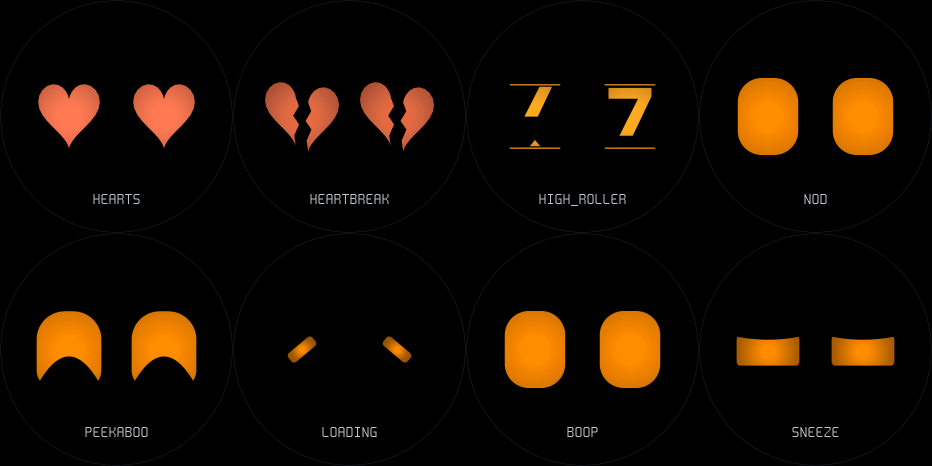
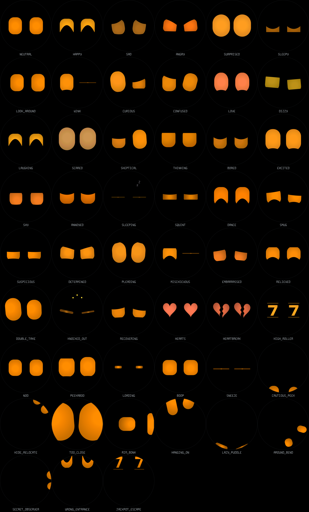

# Character animation exploration

Branch: `codex/character-expressions`. These previews use the actual C firmware
renderer at 466 × 466, simulated at 60 Hz and exported at 20 fps and half size.
Captions and the faint circular outline are preview annotations.

Open [high_roller.mp4](high_roller.mp4) for the revised slot-machine action:
**symbols scroll vertically through fixed windows**, accelerate and slow down,
then the left reel stops at 2.4 s and the right at 3.35 s. Each seven has a small
settling bounce; the face celebrates after both stop. The reel loops at 6.2 s.
The first experiment squeezed and swapped glyphs; this version replaces that
with a continuously moving, clipped strip.

On Windows after fetching this branch:

```powershell
git fetch origin
git switch codex/character-expressions
Start-Process .\docs\expressions\high_roller.mp4
Start-Process .\docs\expressions\playful.mp4
Start-Process .\docs\expressions\recovery.mp4
```

The next round adds [ten actions around the circular edge](RIM_ACTIONS.md):
[watch the full grid](rim.mp4), including peeks, a rim collision, an orbit and
a jackpot escape. The catalog below includes all 51 animations.

## Preview order

| Preview | Order, left to right, top row then bottom |
| --- | --- |
| [Playful actions](playful.mp4) · [GIF](playful.gif) | HEARTS, HEARTBREAK, HIGH_ROLLER, NOD / PEEKABOO, LOADING, BOOP, SNEEZE |
| [Attitude](new.mp4) · [GIF](new.gif) | SMUG, SUSPICIOUS, DETERMINED, PLEADING / MISCHIEVOUS, EMBARRASSED, RELIEVED, DOUBLE_TAKE |
| [Transitions](transitions.mp4) · [GIF](transitions.gif) | One face, 3 s each: SMUG → HEARTS → HEARTBREAK → HIGH_ROLLER → PEEKABOO → NEUTRAL. Deliberately leaves the reel before its final stop to show interruption. |
| [Shake recovery](recovery.mp4) · [GIF](recovery.gif) | Before on left, after on right. Dizzy for 1.5 s, knocked out for 8 s, recovery for 3 s, then neutral. |
| [High roller](high_roller.mp4) · [GIF](high_roller.gif) | One complete reel action and the beginning of its next loop. |



## New choreography

| Action | What happens |
| --- | --- |
| HEARTS | Heart silhouettes with a two-tap heartbeat and a rest between beats. |
| HEARTBREAK | Hearts split along a jagged crack, separate unevenly, lose their beat, then mend and resume beating. |
| HIGH_ROLLER | Scrolling sevens, hearts and diamonds; independent reel stops and a jackpot bounce. |
| NOD | Two affirmative nods with a small overshoot, then settle. |
| PEEKABOO | Close both eyes, peek with one, pop both open, then relax. |
| LOADING | Collapse into short bars, counter-rotate, then reopen. |
| BOOP | Squash, spring taller and settle after an imaginary poke. |
| SNEEZE | Two-stage inhalation, sharp closed-eye compression, recovery squint and release. |
| SMUG | Uneven, half-lidded confidence with a subtle lift. |
| SUSPICIOUS | Narrowed eyes check one side, then the other. |
| DETERMINED | Anticipation followed by a firm forward-focused pose. |
| PLEADING | Big, upward-looking eyes with a restrained pulse. |
| MISCHIEVOUS | Check the room, give a conspiratorial wink, reset. |
| EMBARRASSED | Recoil, look down, cautiously peek back up. |
| RELIEVED | Close slowly, exhale downward, reopen and relax. |
| DOUBLE_TAKE | Glance, dismiss, snap back for a second look, settle. |
| KNOCKED_OUT | Collapse into unequal slumped capsules, with tiny breathing motion and orbiting stars. Replaces the orange X overlays. |
| RECOVERING | Left eye opens before right, a clearing blink, then normal eyes and idle motion return over 3 s. |

These 16 expressions/actions are available through the existing tap/swipe
selector independently of mood. KO and recovery also replace the existing shake
reaction automatically. A spontaneous action scheduler is not added here; the
separate personality layer can select these IDs through `anim_set()`.
Existing voice responses are reused for applicable selections.

## Complete catalog

The original 23 IDs remain unchanged; new IDs are appended. LOVE retains the
original rounded-eye pulse; HEARTS adds an actual heart silhouette.



## Transitions and rendering

Ordinary poses continue easing from their current geometry. Changes between
capsule and symbol silhouettes close the old shape for 120 ms, swap while
thin, and reopen for 160 ms. A second selection during that transition retains
the current closure instead of popping open. Broken hearts part from the closed
crack, so breaking and mending do not need an extra blink. Authored closures
suppress random blinks until their choreography finishes.

Heart and reel outlines use fixed-size Q16 contour edges, the existing
antialiasing and hot-spot shading, the selected eye color/tint and face rotation.
Reel symbols are clipped in local eye coordinates before rotation. The renderer
stores at most 64 edges per eye, about 1 KB per shape, with no heap allocation or
bitmap animation bank. Row rendering uses comparisons and fixed-point multiplies;
edge slopes are calculated once per frame.

## Reproduce and verify

```sh
tools/host/expressions.sh
tools/host/build.sh character_test -fsanitize=undefined -fno-sanitize-recover=all
tools/host/bin/character_test
tools/host/build.sh sweep -fsanitize=undefined -fno-sanitize-recover=all
tools/host/bin/sweep
tools/host/build.sh shape_bench
tools/host/bin/shape_bench
# With the ESP-IDF 5.5 environment loaded:
idf.py build
```

Validation on the development Mac:

- Firmware build passes; not flashed or timed on hardware.
- Character integration checks pass: real shake detection, 8 s KO, 3 s recovery,
  visible eyes, authored blink control, long idle blink intervals, rotated symbol
  bounds, reel scrolling and staggered stops, interrupted silhouette changes,
  and coverage of all changed star pixels by their dirty rectangles.
- UBSan sweep passes across 44,676 frames and all 51 animations, including
  rotation, enlarged face scale, shading and attention; zero bbox/guard violations.
- Host raster samples: shaded hearts about 52 µs/frame, broken hearts rotated
  33° about 73 µs, and shaded reels about 33 µs. These are desktop comparisons,
  not ESP32 performance measurements.

The sweep exposed uninitialized dance state in `anim_init()`; initialization now
clears the state. UBSan also caught signed shifts in the existing eye math, which
now use multiplication. Long scaled blink intervals use a 64-bit product to
avoid wrapping.
