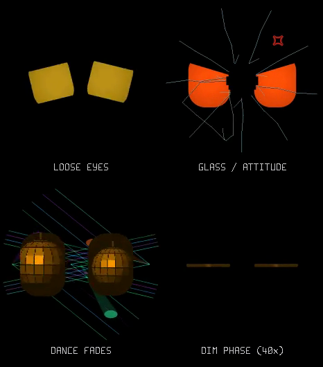

# Handling, affection, anger and finite sleep

[Watch the 18-second firmware-rendered preview](refinements.mp4).
Panels: **loose eyes / glass and attitude / dance fades / dim phase (40× time)**.
Input motion, beats and taps are scripted for comparison. The preview is not a
recording of hardware responsiveness. The last panel compresses the first twelve minutes of the thirty-minute
dozer progression; the other panels run at normal speed.



## Sleep has a deadline on USB too

The old power policy explicitly prohibited SLEEP on USB. In addition, the main
loop treated every accepted audio onset as company, even without admitted music.
Both could keep an unattended companion awake indefinitely. Music Lab also had
no timeout when a browser disappeared without sending STOP.

The default policy now dims after **30 seconds** without touch, meaningful motion
or confirmed music. It spends **thirty minutes dimmed**, then switches the panel off
and enters light sleep on USB or battery. The existing one-hour light-sleep to
power-off policy remains. Touch/motion wake it. USB console protection applies
only between dimmed frames; full sleep can disconnect USB serial.

During the dim phase he starts bored, pleads briefly and gets sleepy. Unequal
50–85 second naps alternate with short bored, sad, pleading, annoyed or rim-puddle
check-ins, then a yawn and another nap. Closed eyes inhale slowly and flutter on
the exhale for a visual snore. These are dimmed performances, not actual wake
activity: none renews the deadline. The neglect contribution moves mood gently
toward mild unhappiness and low energy. Ambient speech cannot continually
rejuvenate the dimmed character.

**An admitted music session always keeps the screen fully awake**, including its
audible breakdown grace period. Power does not demand fresh kicks or re-check
rhythm confidence once behavior has admitted music. When the session exits, the
normal inactivity countdown starts afresh. Unadmitted onsets do not count. A
Music Lab recording now uses a dedicated mode: the analyser stays awake while
the screen and renderer are paused. It persists through USB loss and browser
backgrounding until explicit Disconnect/MC_STOP or a two-second PWR hold.
See [capture reliability](../dance/CAPTURE_RELIABILITY.md).

## Loose eyes, rather than round pucks

The animation ID remains PUCKS for compatibility, but it preserves the current
rounded eye pose at roughly 68% scale (bounded to 50–80%). There is no random
launch velocity. A fast filtered, calibrated screen acceleration vector drives
the bodies toward the low side and opposite shaking acceleration. This is
separate from the slow gravity gaze and scalar sickness meter.

Physics uses two rounded rectangles, a circular boundary, 8 ms substeps, bounded
acceleration and a 900 px/s speed cap. Inertia is exaggerated for legibility on
the display. Damping and inelastic low-speed contacts let them settle. Strong
contacts generate a small sound; quiet supporting contacts do not chatter.
Idle darts, attention drift and elastic distortion do not deform these objects.
The existing 5–10 second game duration and randomized dizzy follow-up remain.

Knockout now needs **7.5 seconds of accumulated strong shaking plus current
strong motion**. Quiet time reduces that accumulator. A nearly full sickness
meter alone cannot make a mild wobble cause knockout. Music retains its motion
immunity.

## Deliberate affection and real interruption

Petting needs **at least four qualifying forehead strokes across at least
1.5 seconds**, with less than two seconds between strokes. Each stroke must
travel at least 60 px with 45 px net displacement. A continuous swipe counts
once; a meaningful reversal rearms it. A stationary finger no longer starts a
purr. Gentle handling remains allowed while petting; walking/rough movement do
not qualify.

Qualified petting enters happy/love/hearts and requests the purr. If the mouth
is busy, it may defer the request while that same petting state remains valid.
Taps, rough handling, menus, sleep and dance clear qualification and invalidate
queued/active purrs. Fresh strokes are required to start again.

The old speech `interrupt` flag only reset the queue. The playback loop now
checks cancellation between 10 ms blocks and emits a short release ramp. A
replacement utterance interrupts active speech as well as queued speech; purr
cancellation leaves unrelated words and impact effects intact. Device I2S
buffering still contributes to the delay heard at the speaker.

## Angry glass gag

The headbutt keyframes had their upper-lid slopes reversed, unlike the ordinary
angry pose. Their inner corners now lower toward the nose. Strong anger adds a
small pulsing red comic anger mark above the right eye, fading in/out with dirty
coverage for rotation and removal.

Each headbutt has a recorded glass-screen bonk at the impact. Every visible
crack-stage extension also has a recorded cracking sound, with a longer final
shatter. [Sources, treatment and WAV order](GLASS_SOUNDS.md). The effects queue holds eight short events,
so a simultaneous bonk and crack cannot overwrite each other.

Crack stages grow along shared, fixed jagged paths. At stage four the existing
nine irregular regions become the falling shards: their fracture edges and
branches are retained, with the circular display rim forming the outer edge.
The stationary shard rendering is pixel-identical to the final cracked overlay.
Regions release individually after a short hold, rotate and fall. All shards
are gone before the same jagged central hole shrinks away; the overlay clears
after 6.5 seconds. The angry face survives
the visual repair. Anger from a headbutt is held for 60–105 seconds depending on
stage; deliberate petting can reconcile him earlier. Nearby speech cannot take
over that hold. Otherwise listening appearances last at most 6.5 seconds, then
wait 18–35 seconds before another; negative or positive moods affect the
listening face instead of always changing it to curiosity.

Shard geometry updates at most 30 Hz. A 15×15 dirty tile mask marks old/new
edges, producing bounded sparse rectangles. In the host sequence, 156 updates
average about 28,000 transferred pixels; stage changes repaint the full display
once. There is no per-pixel physics, dynamic allocation or full-screen particle
simulation.

## Transitions

Pose keyframes already interpolated, but changing animation cleared outgoing
modulation and dance lights immediately. The new selection preserves the last
modulation and eases toward its new motion over 400 ms; outgoing eye fills and
independent background layers fade over 700 ms. Rapid changes retain the current
visible blend rather than restoring a stale full-intensity effect.

The fill shader also used to switch off the eye hotspot immediately. Zero-opacity
fills now match the normal shaded eye pixel for pixel. The extra hotspot blend
runs only during a fade; the full-strength cached fill keeps its integer path.

## Validation and reproduction

Host tests cover the three-hour idle deadline, timestamp wrap, false-onset
rejection, four-stroke qualification, interruption through actual
speech rendering, tap-spam escalation, retained anger under speech, rounded-body
collisions, all-shard removal, damage coverage, tile equality, anger-mark cleanup
and outgoing dance transitions to every animation. Existing audio/rush, character,
rim and renderer regressions also run under UBSan.

The ESP-IDF build passes with a 4 KB stack-frame compile guard. On the connected
board, the normal 30-second transition to dimmed operation and the bored/pleading
sequence were observed over serial; render stack headroom was 11,804 bytes. A
sparse glass job initially exceeded the push task's stack during development;
its storage is now static, and the corrected build booted and ran without that
fault. That was earlier hardware evidence; the September 8 refinements add the
30-minute dim policy, nap/wake cycles, guaranteed admitted-music wake hold,
matched fracture regions and recorded foley.

The previous accelerated 5-second active / 10-second dim test left USB
unresponsive before its transition log was captured. It is not proof of
successful light sleep. On September 8 the current firmware was successfully
flashed, upload hashes verified, and boot output confirmed a 30-second active
timeout and **1,800-second dim period**. This replaces the short-timeout test
firmware. A 45-second boot check showed no panic and admitted dance remained at
100% brightness. Dance samples ranged from 11–60 FPS; sustained heavy frames ran at 15 FPS with
roughly 62 ms average raster time. The subsequent
[dance performance pass](../dance/PERFORMANCE.md) improves those workloads and
records the final on-device timings after USB recovery. No accelerated timeouts will be flashed again. A complete physical
30-minute sleep/wake cycle and speaker balance still need owner confirmation.
Host tests cover the full deadline, three hours of uninterrupted admitted music,
a 36-second audible breakdown and nap/check-in variation.

```sh
tools/host/build.sh review_preview
tools/host/bin/review_preview
ffmpeg -v error -y -f rawvideo -pixel_format rgb24 -video_size 466x530 -framerate 30 \
  -i tools/host/out/refinements.rgb -i tools/host/out/refinements_audio.wav -c:v libx264 -crf 23 -pix_fmt yuv420p \
  -c:a aac -b:a 48k -movflags +faststart docs/expressions/refinements.mp4
```

[Mixed procedural/recorded sound examples](play-sounds.wav): loose-eye contacts (0–5 s), slot
machine (5–12 s), four glass bonks with increasing cracks (12–16 s). Generate with
`tools/host/build.sh play_sounds` and `tools/host/bin/play_sounds`.
