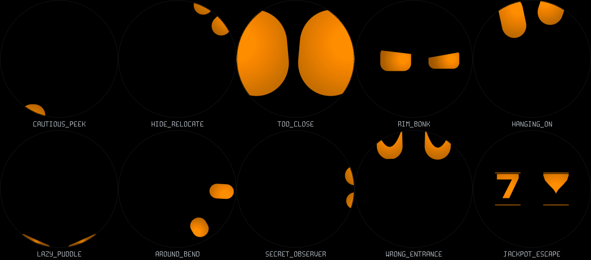

# Playing with the round display

Ten eight-second scenes use the circular edge as somewhere to hide, lean, fall
or collide. They are appended to the animation API as IDs 41–50; all older
IDs are unchanged. Each scene returns to the center before looping.

[Watch all ten together](rim.mp4) · [Animated GIF](rim.gif)

The grid runs left to right, top row then bottom row:

| Action | Scene | Individual video |
| --- | --- | --- |
| CAUTIOUS_PEEK | Duck below the bottom, wait, peek with one eye, let the other join, hide again, pop back up. | [Play](cautious_peek.mp4) |
| HIDE_RELOCATE | Exit left, stay out of sight, peek around the upper right, then return from below. | [Play](hide_relocate.mp4) |
| TOO_CLOSE | Approach until the circle crops the oversized eyes, inspect, blink, then back away sheepishly. | [Play](too_close.mp4) |
| RIM_BONK | Wind up, dash right, compress the leading eye against the rim, recoil and inspect the edge suspiciously. | [Play](rim_bonk.mp4) |
| HANGING_ON | Rise to the top, one eye slips, the other follows, both fall, squash against the bottom and bounce home. | [Play](hanging_on.mp4) |
| LAZY_PUDDLE | Sag onto the lower curve, rest as two slivers, reluctantly open one eye, settle again, then recover. | [Play](lazy_puddle.mp4) |
| AROUND_BEND | Travel around the rim with tangent-aligned eyes; one lags and catches up before both return. | [Play](around_bend.mp4) |
| SECRET_OBSERVER | Peek from the right as a sideways face, creep further in, retreat and return from below. Touch near the hiding edge makes him retreat early. | [Play](secret_observer.mp4) |
| WRONG_ENTRANCE | Disappear upward, re-enter with inverted happy lids, give an uneven puzzled tilt, withdraw, and return correctly from below. | [Play](wrong_entrance.mp4) |
| JACKPOT_ESCAPE | Play the reel sequence, launch above the screen after winning, leave an empty-screen pause, then fall back and bounce. | [Play](jackpot_escape.mp4) |



On Windows:

```powershell
git pull
Start-Process .\docs\expressions\rim.mp4
Start-Process .\docs\expressions\cautious_peek.mp4
```

These are authored actions, independent of mood, previewable here and available
through `anim_set()`. PR #1 replaced manual expression cycling with pokes and
petting. This rebase preserves that touch behavior and the existing idle choices;
the new actions still need to be selected by the personality layer.

## Geometry and transitions

The firmware already draws into a square framebuffer behind a physically round
panel. Eyes now move beyond its visible edge; the panel does the cropping.
Host previews reproduce that physical circular mask, and move their captions
below the circle so the lower edge remains available for acting.

Rim-contact poses compress and tilt along the local tangent. The orbit follows
a circle of radius 175 px, using two sine/cosine pairs per frame and a small lag
on the trailing eye. It writes complete poses through the existing transition
system, so interrupting the orbit eases from the visible position. Hidden
relocations cut only between off-screen poses. Ordinary entrances, falls and
returns use the existing pose interpolation and secondary motion.

Idle blinking and wandering are suppressed during choreography and restored
near the end of each loop. Touch attention remains available; secret-observer
retreat detection accounts for face rotation. Its preview shows the timed
version without a finger; host tests exercise the early touch retreat upright
and rotated.

## Verification

Regenerate all previews with `tools/host/expressions.sh` (C compiler and FFmpeg).
Run the extra scene checks with:

```sh
tools/host/build.sh rim_test -fsanitize=undefined -fno-sanitize-recover=all
tools/host/bin/rim_test
```

The checks count actual rendered pixels inside the physical disc to verify
empty-screen holds, staggered peeks, hidden relocation and the jackpot return.
They also verify touch retreat, interruption during the orbit, and two complete
passes through each of the ten actions. The full 51-animation UBSan sweep and
existing character tests pass. ESP-IDF firmware builds successfully; this round
has not been flashed or measured on the board.
