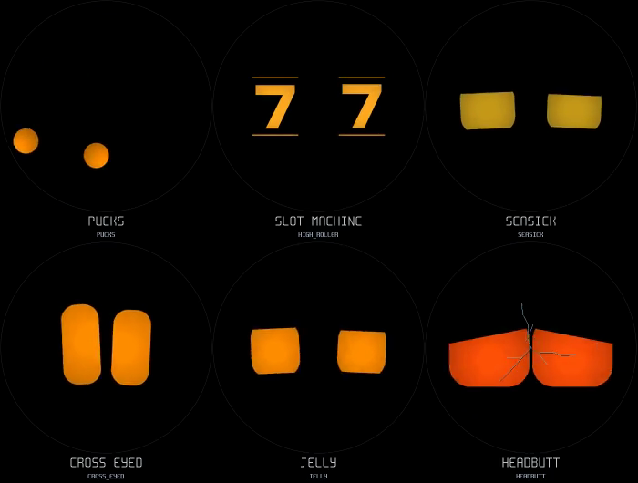
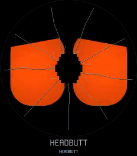

# Wobble games, touch escalation and caresses

[Watch the 12-second animation grid](play.mp4).
Order: **pucks, slot machine, seasick / cross-eyed, jelly, headbutt**.
The pucks, reels and jelly finish in the regular dizzy face. The headbutt panel
shows four successive stages; actual firmware requires a fresh burst of taps
between each stage. Preview inputs and timing are scripted, using the real C
physics, animation and compositor at 60 Hz, exported at 30 Hz.



[Listen to the procedural effects](play-sounds.wav): **0–5 s puck rebounds,
5–12 s reels and stops, 12–16 s four impacts with increasing glass sounds**.
16 kHz mono PCM16, about 500 KB. These sounds are synthesized on the board;
the WAV is only an audition. The video is silent. The producing agent cannot
listen, so sound balance still needs the owner's speaker check.

```powershell
Start-Process docs/expressions/play.mp4
Start-Process docs/expressions/play-sounds.wav
```

## Wobbling has memory

A new internal sickness value accumulates with motion and slowly recovers at
rest. It supplements the existing accumulated-shake threshold, rather than
replacing the music detector or ordinary gentle-motion deadband. Bad treatment
still affects valence; stimulation affects the chance of a playful detour.
Long gaps in IMU sampling are capped so waking does not count as a long shake.

When shaking would cause dizziness:

- There is a mood/energy-dependent chance of a game, with an 18-second minimum
  interval between game starts. Near exhaustion goes directly to sickness.
- Predominantly USB-to-lanyard motion selects the high roller when the game
  draw succeeds. The physical screen-axis measurement compares recent changes
  on all three accelerometer axes; it does not depend on face rotation.
- Other successful draws choose detached pucks (80%) or rubbery jelly (20%).
  These run 5–10 seconds. Reels play their complete 6.2-second cycle.
- Every game ends in dizziness. The dizzy variant is ordinary dizziness (45%),
  seasick (30%), or cross-eyed (25%). Its minimum hold is randomized to 4–8
  seconds, plus up to two seconds from sickness. Continued shaking can extend
  it; stopping no longer clears the face immediately.
- Enough continued motion overrides the game or dizzy hold with the existing
  eight-second knocked-out state and staggered recovery. Dance mode suppresses
  both accumulated shaking and sickness; face-down and power reactions retain
  priority.

The pucks shrink free of their normal eye positions, then move as two round
bodies. They rebound from the circular rim and each other, with mild gravity
influence. Eight-millisecond physics steps are bounded to eight per render
frame. They bypass gaze scaling, blinks and elastic stretching while detached.
Impacts produce short high-frequency taps; simultaneous contacts in one render
frame share one tap. Reels produce decelerating ticks and two stop notes.

## Repeated pokes get a headbutt

Four taps within 1.5 seconds, while idle or in the ordinary poke response,
trigger an anticipation, forward slam and angry recoil. Taps during that
three-second performance do not skip ahead. A new burst after it finishes
advances the stage:

1. Headbutt and impact sound.
2. Fine simulated cracks and a glass tick.
3. More extensive cracks and a stronger angry response.
4. A fractured centre with a small jagged missing patch.



Each stage reduces valence more strongly. The first three stages remember the
sequence for 45 seconds; the final broken-screen gag repairs itself after
6.5 seconds from impact. The cracks are a cosmetic overlay, not persistent
settings or a simulated firmware failure. Fresh touch during a high-priority
reaction or dance cannot start this game. Fractures use a fixed integer line
pattern, and their static overlay only adds full-screen damage when its stage
changes; normal eye damage is composited under it between changes.

## Purring regression

The touch driver emits a swipe on release. That missed continuous back-and-forth
caresses, especially when their end position was close to their start. A small
host-testable tracker now samples the current finger position in the upright
face frame. It recognizes deliberate movement in the upper 185 pixels while
the finger remains down. It rejects stationary jitter, discontinuous coordinates
and strokes outside the head region.

Two recognized movements still qualify petting. Light motion from caressing a
held device is allowed, while walking rhythm and stronger movement reject or
end petting. A purr whose entry was blocked by a busy mouth now waits while the
petting state remains active, instead of losing the request. The love → beating
hearts → happy playback sequence is preserved. Stationary grips still use the
separate stable-hold gate and do not receive the caress exception.

## Validation and cost

`play_test` checks continuous caresses, 499 deterministic random draws,
minimum dizzy holds, all game routes, exhaustion preemption, a recovering
sickness gauge, 1,580 puck contacts across 79 trials, circle bounds, separation,
rigid rendering, all four tap stages, crack tile equality, automatic repair,
and bounded procedural effects. `interaction_test` includes a full continuous
caress → behavior → persona replay with slight hand motion and a busy mouth.
Existing character, rim, dance, audio and renderer sweep checks are also used.

The effect mixer has three fixed voices, integer oscillators/envelopes and a
single latest-event mailbox. It mixes into the existing 16 kHz audio blocks,
including during speech. No clip bank, task, FFT or heap allocation per effect
is added. The physics adds two small bodies; fractures use integer sparse
lines. Actual board timing and sound balance need a connected-device check.

Regenerate:

```sh
tools/host/play.sh
tools/host/build.sh play_sounds && tools/host/bin/play_sounds
tools/host/build.sh play_test -fsanitize=undefined -fno-sanitize-recover=all
tools/host/bin/play_test
```
